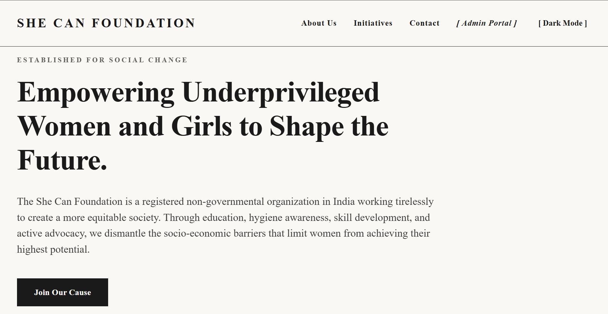
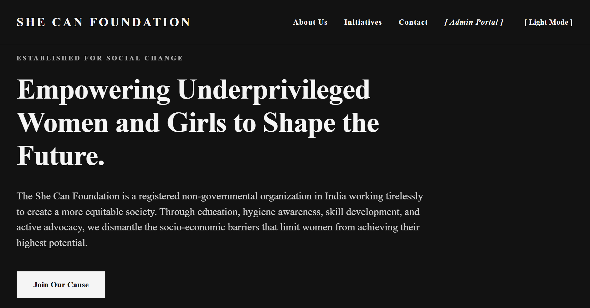
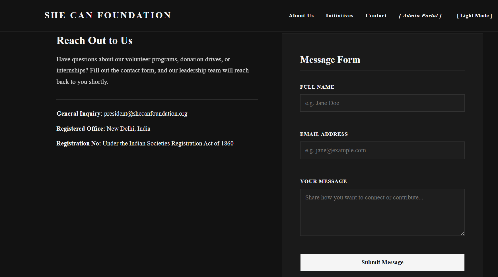
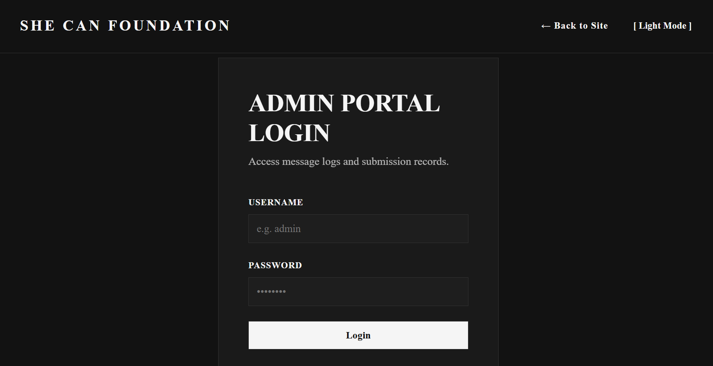
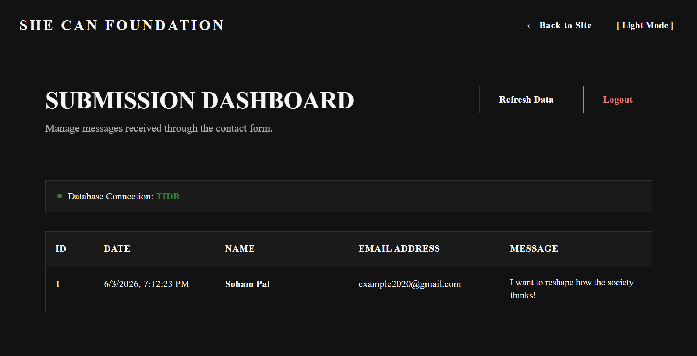

# She Can Foundation - NGO Portal & Contact System

A responsive, high-aesthetic web application for the **She Can Foundation** (a registered non-governmental organization empowering women and girls in India). This portal allows visitors to learn about the NGO's pillars of impact, submit contact messages, and enables administrators to review these submissions securely.

---

## Key Features

- **Premium Design**: Editorial-inspired typography and layout with full responsiveness.
- **Theme Toggle**: Seamless switching between light and dark modes.
- **Contact Form**: Implements robust client-side validation and server-side safety checks (preventing empty submissions or invalid email formats).
- **Admin Portal**: A password-protected page (`/admin`) for administrators to view and manage user submissions.
- **Resilient Dual-Database Fallback**:
  - **Production**: Connects securely to a **TiDB Cloud** (MySQL-compatible) database with SSL verification.
  - **Fallback**: Automatically falls back to a local **SQLite** database (`submissions.db`) if the remote database is unreachable or unset, ensuring zero downtime.

---

## Visual Previews & Screenshots

### Public Portal (Light & Dark Theme Toggle)
| Light Mode | Dark Mode |
| --- | --- |
|  |  |

### Contact Form & Submission Feedback
| Contact Submission Form |
| --- |
|  |

### Admin Portal & Dashboard
| Admin Login | Submissions Dashboard |
| --- | --- |
|  |  |

---

##  Project Structure

```text
she-can-foundation-task/
│
├── screenshots/
│   ├── light_mode.png
│   ├── dark_mode.png
│   ├── submission.png
│   ├── admin_login.png
│   └── submission_dashboard.png
|
├── static/
│   ├── css/style.css     # Premium styling
│   └── js/main.js        # Form validation, network requests, & theme toggle
│
├── templates/
│   ├── index.html        # Public homepage & contact form
│   └── admin.html        # Secure admin panel
│
├── app.py                # Flask application & database routing logic
├── ca.pem                # TiDB Cloud SSL CA certificate
├── requirements.txt      # Python dependencies
├── .env                  # Environment variables
├── .env.example          # Environment template
└── .gitignore            # Git exclusions
```

---

##  Local Installation & Setup

### 1. Clone the Repository
```bash
git clone <your-repo-url>
cd she-can-foundation-task
```

### 2. Set Up a Virtual Environment
```bash
# Windows
python -m venv venv
venv\Scripts\activate

# macOS / Linux
python3 -m venv venv
source venv/bin/activate
```

### 3. Install Dependencies
```bash
pip install -r requirements.txt
```

### 4. Configure Environment Variables
Copy `.env.example` to a new file named `.env`:
```bash
cp .env.example .env
```
Fill out the variables in `.env`:
- To use **TiDB Cloud**, enter your host, user, password, and the absolute path to `ca.pem` in `DB_SSL_CA` (e.g. `c:\Users\...\she-can-foundation-task\ca.pem`).
- If you leave database credentials empty, the system will seamlessly initialize and use a local SQLite database (`submissions.db`).

### 5. Run the Server
```bash
python app.py
```
Open [http://localhost:5000](http://localhost:5000) in your browser.
